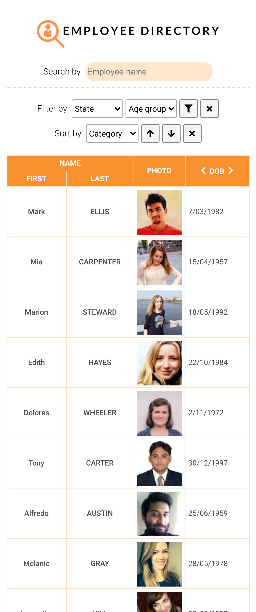

# Employee Directory

## Description 

*Employee Directory* is an application where employers/managers can view a table of non-sensitive employee information, including:
- Name (first & last)
- Photo (72x72)
- Date of birth 
- Address
- Email
- Mobile number 

Additional features: 
- Search employees by name
- Filter employees by state/territory and/or age group
- Sort employees by first name, last name or age in ascending or descending order

For user convenience and accessibility, *Employee Directory* is also mobile-friendly.

## Table of Contents

- [Technologies Used](#Technologies-Used)
- [Screenshots](#Screenshots)
- [Link to deployed application](#Link)
- [Questions](#Questions)

## Technologies Used

- React
- JSX
- JavaScript
- Axios
- Random User Generator API ([randomuser.me](https://randomuser.me/))
- Mark.js 
- Moment.js
- CSS 
- Google Fonts
- Font Awesome
- Canva

## Screenshots 

### Large viewport 

### Medium viewport 

### Small viewport 

## Link

Link to deployed application: [jkaho.github.io/employee-directory/](https://jkaho.github.io/employee-directory/)

## Questions

**My GitHub Profile**: [jkaho](https://github.com/jkaho)

If you have any further questions, please feel free to email me at [j.h-7@yahoo.com](mailto:j.h-7@yahoo.com).

